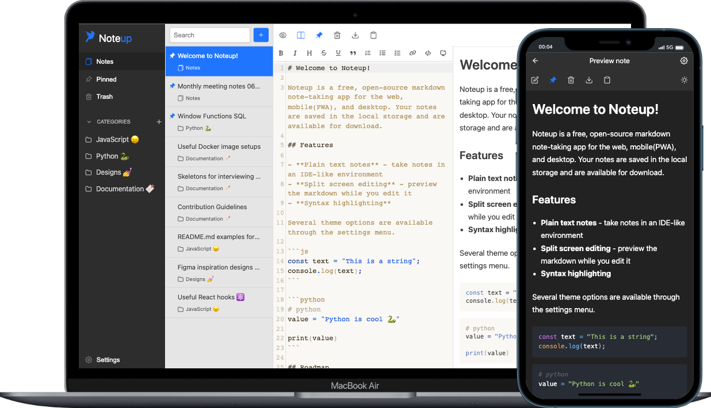

[](https://app.netlify.com/sites/stupendous-cucurucho-1aee31/deploys)

<h2 align="center">
  
  Noteup

[Live version](https://noteup.dev/)

</h2>

<p align="center">A web and desktop markup notes app.</p>



[Noteup](https://noteup.dev/) is a free, open-source markup notes app for the web, mobile(PWA) and desktop. Your notes are saved in the local storage, but are available for import/export.

## Get started

To get started just visit [noteup.dev](https://noteup.dev) or [download a build](https://github.com/elementsinteractive/Noteup/releases) or clone the repo and run the install and start scripts

```properties
yarn install
```

```properties
yarn start
```

To run the desktop version, after installing run

```properties
yarn tauri dev
```

To make a desktop build run

```properties
yarn build
yarn tauri build
```

## Roadmap

- [x] Tandem scroll for side-by-side editing
- [x] Quick command bar (WYSIWYG style)
- [ ] Add landing page to the website
- [ ] Add a page with markdown help commands
- [ ] Note sharing
- [ ] Account sync
- [ ] Cross-platform sync
- [ ] Extra download options (like `.pdf`)

## Contributing

This is an open source project, and contributions are welcomed and appreciated. Open issues, bugs, and enhancements are all listed on the [issues](https://github.com/elements/noteup/issues) tab and labeled accordingly.

View [CONTRIBUTING.md](CONTRIBUTING.md) to learn about the style guide, folder structure, scripts, and how to contribute.

## Inspirations

This project was visually inspired by another markdown note app called [Takenote](https://github.com/taniarascia/takenote) and the macOS notes app.

## Contributors ✨

Thanks goes to these wonderful people ([emoji key](https://allcontributors.org/docs/en/emoji-key)):

<!-- ALL-CONTRIBUTORS-LIST:START - Do not remove or modify this section -->
<!-- prettier-ignore-start -->
<!-- markdownlint-disable -->
<table>
  <tbody>
    <tr>
      <td align="center"><a href="https://github.com/GarliqBread"><br /><sub><b>Cláudio Silva</b></sub></a><br /><a href="https://github.com/elementsinteractive/Noteup/commits?author=GarliqBread" title="Code">💻</a> <a href="https://github.com/elementsinteractive/Noteup/commits?author=GarliqBread" title="Documentation">📖</a> <a href="#maintenance-GarliqBread" title="Maintenance">🚧</a></td>
    </tr>
  </tbody>
</table>

<!-- markdownlint-restore -->
<!-- prettier-ignore-end -->

<!-- ALL-CONTRIBUTORS-LIST:END -->

## Author

- [Cláudio](https://github.com/GarliqBread)

## License

This project is open source and available under the [MIT License](LICENSE).
